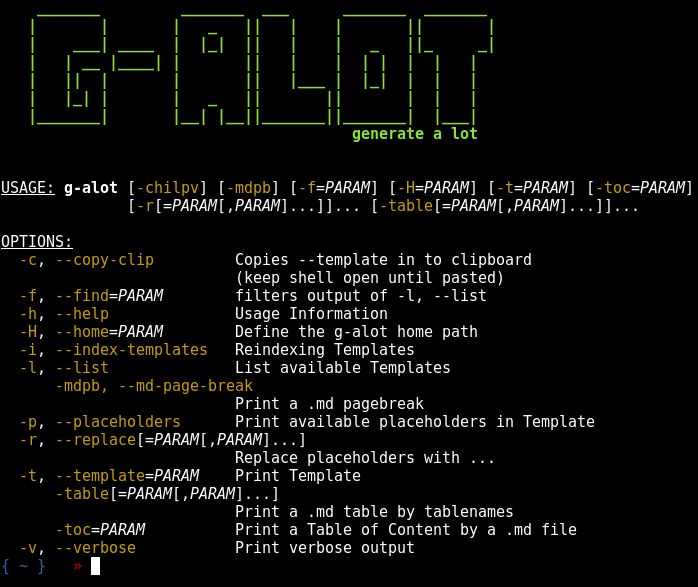

```
    _______         _______  ___      _______  _______ 
   |       |       |   _   ||   |    |       ||       |
   |    ___| ____  |  |_|  ||   |    |   _   ||_     _|
   |   | __ |____| |       ||   |    |  | |  |  |   |  
   |   ||  |       |       ||   |___ |  |_|  |  |   |  
   |   |_| |       |   _   ||       ||       |  |   |  
   |_______|       |__| |__||_______||_______|  |___| 
```
> Prints templates to the terminal  

- [Open Points](#open-points)
- [Getting Started](#getting-started)
  - [Requirements](#requirements)
  - [Installation](#installation)
- [Add new Template](#add-new-template)
- [Link templates template `g-alot:link{template}`](#link-templates-template-g-alot-link-template)
  - [Example (link)](#example-link)
- [Replace placeholders in template `g-alot{placeholder}`](#replace-placeholders-in-template-g-alot-placeholder)
  - [Example (simple)](#example-simple)
  - [Example (file)](#example-file)




## Open Points
- ~~recursive find templates~~
- ~~display placeholders in template `g-alot{placeholder}`~~
- ~~replace placeholders in template `g-alot{placeholder}`~~
- ~~include other templates in template `g-alot:link{template}`~~
- include other templates in template `g-alot:link{template}` **recursive**
- ~~load templates from cache `g-alot:link{template}`~~
- ~~search in templates `-f=` → toLowerCase contains~~
- ~~replace from file  
`galot -t test-main.groovy -r "content:</etc/passwd,age:88"`~~
- code clean up

## Getting Started

### Requirements
- Groovy in `$PATH` variable
### Installation
- Download the script  
`git clone ...`
- set alias in `~/.zshrc` ot `~/.bashrc`  
`alias galot="groovy repos/g-alot/GAlot.groovy --home /path/to/g-alot"`
- test  
`galot`

## Add new Template
> Just add a file in one of th subfolder in the `g-alot` directory, you can even create new directories.  
Those templates will be listed when calling `galot -l`  
The template name is a concatination of the filename and its parent directory name  
>  
> **Important**:  
> after adding a new template you have to reindex the templates:  
> `galot -i` or `galot -i -v` for verbose output

## Link templates template `g-alot:link{template}`

### Example (link)
```
g-alot:link{spring-Repository.java}

g-alot:link{spring-IService.java}

g-alot:link{spring-ServiceImpl.java}

g-alot:link{jpa-Entity.java}
```

## Replace placeholders in template `g-alot{placeholder}`
> Allowed: `A-Z, a-z, 0-9, <,-,/`
### Example (simple)
- Template `test-main.groovy` in `G-ALOT Home/test/main.groovy`  
```groovy
println "Hello g-alot{name} you are g-alot{age} years old"
```
- Command  
`galot -t test-main.groovy -r name:lala,age:88`
- Output  
```
println "Hello lala you are 88 years old"
```
### Example (file)
- Template `test-main-file.groovy` in `G-ALOT Home/test/main-file.groovy`  
```groovy
println """
g-alot{content}
"""
```
- Command  
`galot -t test-main.groovy -r "content:</etc/passwd"`
- Output  
```
println """
root:x:0:0:root:/root:/bin/zsh
daemon:x:1:1:daemon:/usr/sbin:/usr/sbin/nologin
bin:x:2:2:bin:/bin:/usr/sbin/nologin
...
"""
```